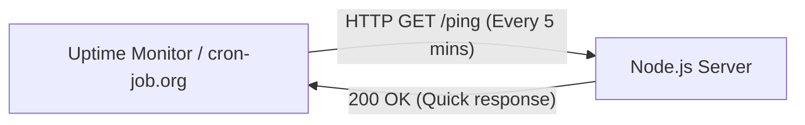

# Premium Server Keep-Alive & Uptime Setup Guide

To prevent free-tier hosting servers (like Render or Glitch) from sleeping or becoming inactive after periods of user inactivity, we use a lightweight, safe, and 100% free external monitoring system combined with an optimized health-check endpoint on the server.

---

## 💡 The Strategy (How It Works Safely)



1. **Lightweight Endpoint (`/ping`)**: 
   We add a `/ping` route that immediately returns a simple JSON message. It bypasses any database query, encryption, or heavy workload to ensure the keep-alive request uses virtually zero memory and CPU.
   
2. **External Pinger (UptimeRobot / Cron-Job.org)**:
   We configure a free third-party monitoring service to send a request to your server's `/ping` URL every 5 minutes. This constant traffic tells the host (e.g., Render) that the server is active, preventing it from shutting down.

---

## 🛠️ The Proposed Code Changes

Here is the exact code that was added to **`server/server.js`**:

### 1. The Uptime Health Endpoint
```javascript
// --- LIGHTWEIGHT HEARTBEAT ENDPOINT ---
app.get('/ping', (req, res) => {
    res.status(200).json({ 
        status: "alive", 
        timestamp: new Date().toISOString() 
    });
});
```

---

## 🚀 How to Setup the Uptime Monitor for Free (2 Minutes)

There are two premium, 100% free uptime services you can use. We recommend **Cron-Job.org** because it offers unlimited checks down to 1-minute intervals for free.

### Option A: Setup using Cron-Job.org (Recommended)
1. Go to [cron-job.org](https://cron-job.org) and create a free account.
2. In the dashboard, click **"Create Cronjob"**.
3. Fill in the following details:
   - **Title**: `Skill Notes Keep-Alive`
   - **Address (URL)**: `https://your-server-url.onrender.com/ping` *(Replace with your actual public server URL)*
   - **Request Method**: `GET`
   - **Execution Schedule**: Select **"Every 5 minutes"** (or 5 minutes interval).
4. Click **"Create"**.
5. *Done!* Cron-job.org will now query your server's endpoint every 5 minutes, ensuring it stays active 24/7.

### Option B: Setup using UptimeRobot
1. Go to [uptimerobot.com](https://uptimerobot.com) and sign up for a free account.
2. Click **"Add New Monitor"**.
3. Choose:
   - **Monitor Type**: `HTTP(s)`
   - **Friendly Name**: `Skill Notes Server`
   - **URL (or IP)**: `https://your-server-url.onrender.com/ping`
   - **Monitoring Interval**: Set slider to **"Every 5 minutes"**.
4. Click **"Create Monitor"**.
5. *Done!* UptimeRobot will ping the health check page to maintain continuous execution.

---

> [!IMPORTANT]
> This strategy is fully safe and compliant. Uptime monitors only send basic HTTP requests, which is standard web traffic. Your server will process these requests instantly without affecting users or performance.
